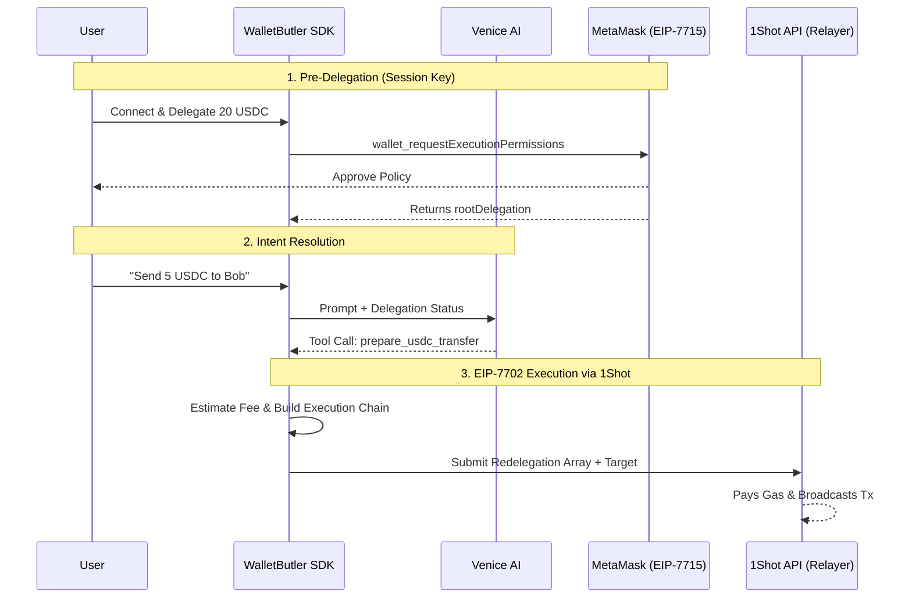
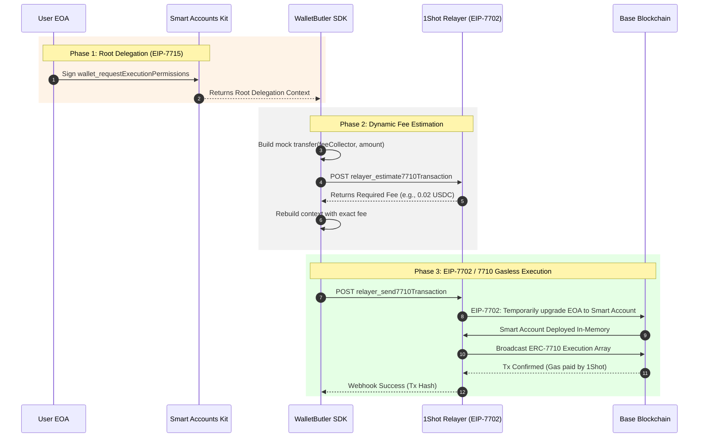
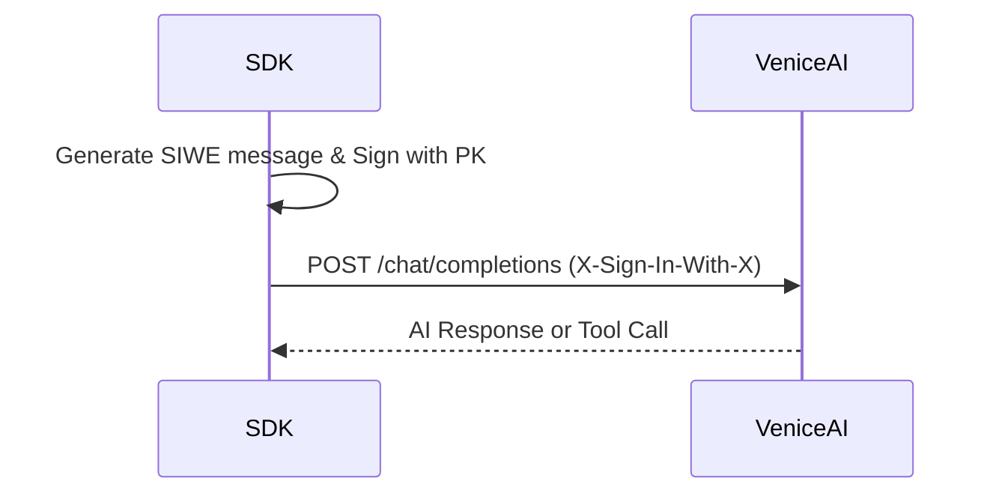
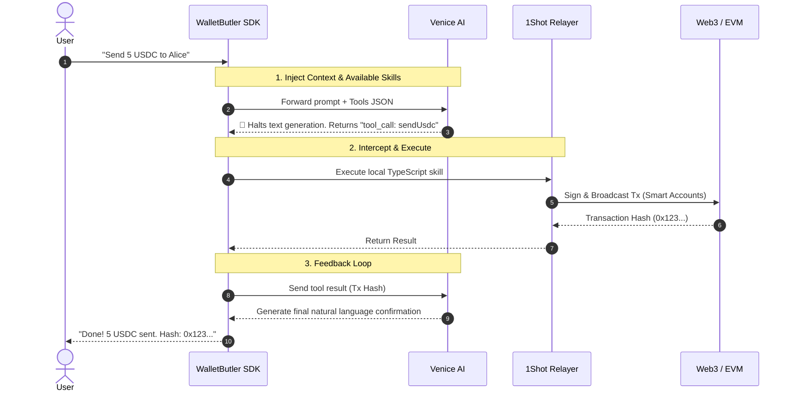

<div align="center">
  <h1>🤖 Wallet Butler SDK</h1>
  
  [](https://opensource.org/licenses/MIT)
  [](https://www.typescriptlang.org/)
  [](https://metamask.io/)
  [](https://1shotapi.com/)
  [](https://venice.ai/)

  *The ultimate one-line primitive for autonomous, zero-gas agentic Smart Accounts.*

  > **TL;DR:** Wallet Butler SDK is the ultimate infrastructure primitive that instantly upgrades any normal wallet into a **Smart Account with superpowers**. We abstract away the extreme complexity of MetaMask EIP-7715 delegations, 1Shot EIP-7702 Relayers, and Venice AI x402 authentication. Drop it into your DEX or dApp to enable AI-driven autonomous transactions where **users will NEVER need ETH or native tokens for fees ever again.**
</div>

---

## 🌟 Key Features

- **Zero-ETH Forever (Gasless Execution)**: Users will **NEVER** need to hold ETH, MATIC, or any native token to pay for gas again. They delegate permissions once, and the Agent executes on-chain actions forever using stablecoins or sponsored relayers.
- **Normal Wallets gain Superpowers**: Instantly upgrades standard EOAs into programmable Smart Accounts via EIP-7702, granting them autonomous AI capabilities without requiring the user to migrate their wallet.
- **Deep Venice AI Integration**: Uses Venice's Llama-3.3-70b with native Tool Calling and Crypto RPCs to reason about blockchain state and parse human intents into calldata.
- **1Shot API Relayer Engine**: Fully abstracts the EIP-7710/7702 execution pipeline. Estimates fees, builds the execution chain, and relays it permissionlessly.
- **MetaMask Smart Accounts Kit Native**: Leverages standard `wallet_requestExecutionPermissions` for absolute security and standard compliance.

> [!NOTE] 
> **Architectural Transparency:** WalletButler SDK uses **Venice RPCs** for all Agent-driven blockchain reads (using dynamic `x402` SIWE headers). However, for the MetaMask Smart Accounts Kit SDK to construct redelegation signatures, we fallback to public Base RPCs, as the underlying `viem` transport cannot natively inject dynamic authentication headers.

## 🧠 How It Works (Macro Architecture)

WalletButler seamlessly connects decentralized AI with on-chain execution through a tripartite architecture: **Venice AI (Brain)**, **MetaMask Smart Accounts (Permissions)**, and **1Shot API (Execution)**.



### 🤝 The Symbiosis: Smart Accounts & 1Shot Relayer Architecture
The true power of the WalletButler SDK lies in how it seamlessly stitches together EIP-7715 and EIP-7702/7710 without the user noticing. The execution layer relies on a highly sophisticated **Just-In-Time (JIT) Redelegation** pipeline. The user never holds ETH, and the Agent never holds funds. 

Here is the exact cryptographic flow happening in the codebase:



#### 🔬 The Deep Code Flow
1. **Smart Account Root Delegation (EIP-7715)**: In `src/lib/delegation.ts`, the SDK calls `wallet7715.requestExecutionPermissions()` targeting the user's EOA. We request a strictly scoped `erc20-token-periodic` policy for the exact USDC contract. The SDK then uses `decodeDelegations(context)` to parse the returned cryptographic `context` into a JSON-serializable array.
2. **1Shot Relayer Fees (Dynamic Fee Extraction)**: We cannot pay ETH for gas. In `src/lib/oneshot.ts`, the SDK dynamically estimates the fee using `relayer_estimate7710Transaction` and prepends a transfer to the `FEE_COLLECTOR` in the execution block. 1Shot simulates the Tx and returns the exact gas cost `requiredPaymentAmount` in USDC. The SDK rebuilds the context and locks it. **The user pays $0 in ETH; fees are abstracted into USDC.**
3. **EIP-7702 Gasless Submission**: We call `relayer_send7710Transaction`, passing the locked `context` and `destinationUrl` webhook. **The 1Shot Magic:** Because the originating wallet is a standard EOA, 1Shot automatically performs an **EIP-7702** in-memory upgrade, granting the EOA Smart Account capabilities. 1Shot executes the EIP-7710 payload, pays the network ETH gas out of pocket, extracts the exact USDC fee we approved, and executes the transfer.
4. **Deterministic Webhook Updates**: To achieve maximum reliability, the SDK does not poll the blockchain. Instead, it leverages the **1Shot Relayer Webhooks** (`destinationUrl`) as the absolute source of truth for transaction status updates. Once 1Shot confirms the block, the webhook triggers the frontend state to update the user in real-time.

## 🤖 The Venice AI Brain (Under the Hood)

At its core, WalletButler relies on **Venice AI** not just as a chatbot, but as a deterministic decision-making engine. The brain operates on two levels: the decentralized network layer, and the autonomous execution loop.

### 1. The Network Layer (High-Level Connection)
WalletButler connects to Venice without centralized API keys. It uses the **x402 protocol** and **SIWE** (Sign-In with Ethereum) to pay for inference dynamically.



### 2. The Native Tool Calling Loop
WalletButler uses a **Native Tool Calling Loop** to connect natural language with blockchain execution.



### 3. Comprehensive Venice Ecosystem Integration
To maximize the power of permissionless intelligence, WalletButler SDK connects to **every applicable Venice endpoint and feature**:
- **`GET /api/v1/models`**: Dynamically verifies the node's health and ensures the `llama-3.3-70b` model is active before executing critical Web3 intents.
- **`GET /api/v1/x402/balance`**: Queries the agent's available VCU (Venice Compute Units) and USD balances purely via cryptographic signature (SIWE), bypassing any centralized accounts.
- **`POST /api/v1/crypto/rpc`**: The SDK uses the Venice Crypto RPC dynamically to read block states and deterministic Smart Contract data without external indexers.
- **`POST /api/v1/chat/completions`**: Leveraged extensively with the `tools` parameter. This forces the `llama-3.3-70b` model to evaluate the user's intent and return a strictly formatted JSON tool call instead of conversational text.
- **Web Search & Web Scraping**: By injecting `venice_parameters: { enable_web_search: "on", enable_web_scraping: true }`, the Agent performs live web research to gather off-chain context before making on-chain decisions.
- **Venice Compute Costs**: Handled via the Agent's x402 balance. Our SDK monitors `x402BalanceUsd` to prevent agent depletion.

## 🚀 Quick Start (SDK Installation)

To install the primitive in your own dApp:

```bash
npm install walletbutler-sdk @metamask/smart-accounts-kit viem
```

**Usage in your React App:**

```tsx
import { useAgenticAccount } from "walletbutler-sdk/hooks";

export default function MyDex() {
  const { delegate, executeIntent } = useAgenticAccount({
    chainId: 84532, // Base Sepolia
    veniceModel: "llama-3.3-70b"
  });

  return (
    <div>
      <button onClick={() => delegate(50, 7)}>
        1. Grant Agent Permission (50 USDC / 7 Days)
      </button>
      
      <button onClick={() => executeIntent("Send 10 USDC to vitalik.eth")}>
        2. Let Venice + 1Shot Handle Everything
      </button>
    </div>
  );
}
```

## 🏗️ Project Structure

```text
├── agent/            # AI Identity, system prompts, and skill descriptions
│   ├── identity.md
│   └── skills/       # Deterministic skills (send-usdc, onchain-rpc)
├── app/              # Next.js App Router (UI Dashboard & API Routes)
│   ├── api/          # Webhooks for 1Shot and Venice proxies
│   └── page.tsx      # Demo dApp integrating the SDK
├── src/              # Core Execution Engine & SDK
│   ├── venice.ts     # Venice AI service & x402 SIWE authentication logic
│   ├── lib/          # Smart Accounts (delegation.ts) & Relayer (oneshot.ts)
│   └── sdk/          # 👈 Exported Primitive hook for external devs
├── package.json      # Dependencies and scripts
└── next.config.mjs   # Next.js configuration
```

---
*Built for the MetaMask Smart Accounts Kit x 1Shot API x Venice AI Dev Cook-Off (June 2026).*
