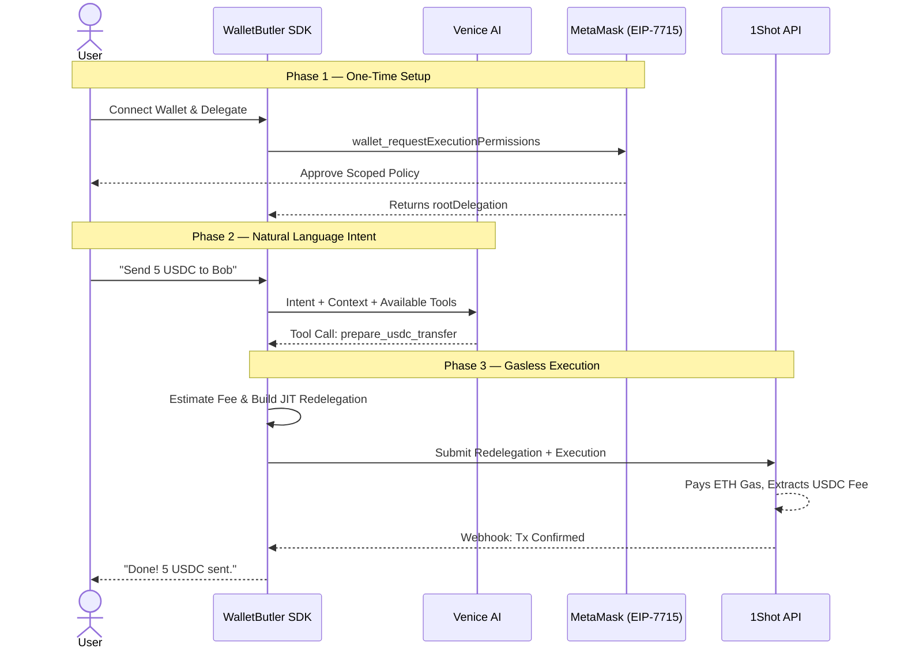
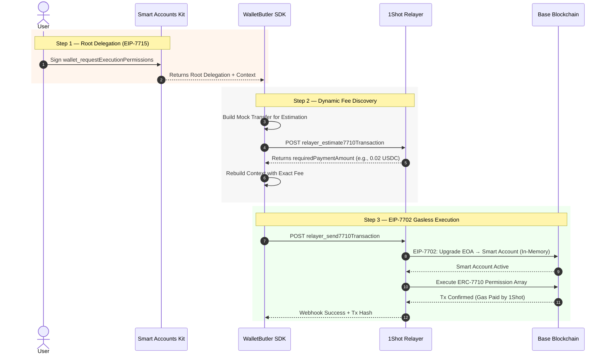
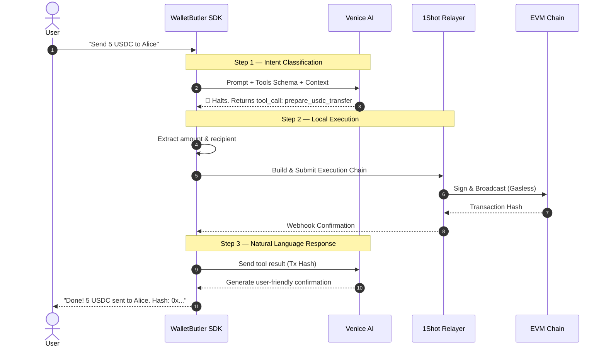

<div align="center">

# 🤖 Wallet Butler SDK

*The open-source reference SDK that turns any dApp into an autonomous, zero-gas Smart Account powerhouse.*

[](https://www.typescriptlang.org/)
[](https://metamask.io/)
[](https://1shotapi.com/)
[](https://venice.ai/)
[](https://github.com/JaDi03/walletbutler-sdk/blob/main/LICENSE)

**🌐 Live Demo:** [walletbutler-sdk.vercel.app](https://walletbutler-sdk.vercel.app)

</div>

---

## 🎯 TL;DR: Why Every dApp Needs a Butler

**Wallet Butler SDK** is an open-source infrastructure reference that upgrades any wallet into a **gasless, AI-powered Smart Account**. Clone it, configure your keys, and plug the core modules directly into your dApp.

We abstract the extreme complexity of **MetaMask EIP-7715** delegations, **1Shot EIP-7702** relayers, and **Venice AI** x402 authentication into well-documented, composable modules that any developer can integrate into their DEX, NFT marketplace, DeFi protocol, or consumer app. Users connect their regular wallet, delegate permissions once, and from that moment on, an AI agent executes on-chain actions on their behalf — **without them ever holding a single wei of ETH for gas**.

This isn't a wallet. This isn't a bot. This is the **missing middleware** that makes Web3 feel like Web2 for the next billion users.

---

## 🚀 The Problem: Gas is the Final Boss of Crypto Adoption

The current onboarding funnel is broken:

1. User downloads MetaMask
2. User buys ETH on a CEX (KYC, waiting, fees)
3. User bridges ETH to the right chain (more fees, more waiting)
4. User finally interacts with your dApp
5. **User runs out of ETH for gas mid-transaction**

For non-crypto-native users, this is a brick wall. For dApp developers, every abandoned funnel is lost revenue. The friction isn't in wallet UX — it's in the fundamental requirement that users must hold volatile native tokens just to pay for computation.

Wallet Butler SDK removes that wall entirely.

---

## 💡 The Solution: Stablecoin-Only, Gasless-by-Default Infrastructure

Wallet Butler SDK introduces a **three-pillar architecture** that completely reimagines how users interact with blockchains:

| Pillar | Technology | What It Solves |
|--------|-----------|----------------|
| **🧠 Brain** | Venice AI (Llama-3.3-70b) | Natural language intent → deterministic blockchain execution |
| **🔐 Permissions** | MetaMask Smart Accounts Kit (EIP-7715) | Scoped, revocable delegations with zero trust assumptions |
| **⚡ Execution** | 1Shot API (EIP-7702/7710 Relayer) | Gasless transaction relay paid in USDC, not ETH |

**The result:** Users hold USDC. They speak in plain English. The Butler handles the rest. No ETH. No gas anxiety. No abandoned carts.

---

## 🌟 Key Features

- **Zero-Native-Token Gas Abstraction**: Users never need ETH, MATIC, or any native token. 1Shot's relayer pays network gas and extracts fees in USDC automatically.
- **Composable SDK Modules**: Fork the repository and integrate `useAgenticAccount()`, `delegation.ts`, or `oneshot.ts` independently into any React or Node.js app.
- **EIP-7715 Advanced Permissions**: Scoped, time-bound, amount-capped delegations via MetaMask's native `wallet_requestExecutionPermissions`. Users retain full control.
- **Just-In-Time Redelegation**: Our JIT chain dynamically computes exact execution amounts and builds a cryptographically signed redelegation on every transaction.
- **Venice AI Native Tool Calling**: llama-3.3-70b with forced tool-calling schema converts "send 5 USDC to Alice" into a structured, executable payload.
- **x402 Wallet Authentication**: Agent pays for its own Venice inference via cryptographic SIWE signatures — no API keys, no centralized accounts.
- **Multi-Network Support**: Base Mainnet and Base Sepolia with dynamic USDC contract resolution.
- **Deterministic Webhook Settlement**: No blockchain polling. 1Shot pushes transaction confirmations via webhooks for instant UI updates.
- **Web Search & Scraping**: Venice's native web research tools give the agent real-world context before executing on-chain actions.

---

## 🏗️ Architecture Deep Dive

### Macro Flow: From Intent to On-Chain Reality



### The Cryptographic Pipeline (How It Actually Works)



---

## 📋 Smart Accounts Kit Usage

The Wallet Butler SDK is built entirely on the **MetaMask Smart Accounts Kit**. We use the full delegation lifecycle: requesting permissions, decoding delegation contexts, creating redelegations, and executing through 1Shot's EIP-7702 relayer.

### Advanced Permissions

We request scoped, time-bound execution permissions via the standard EIP-7715 flow:

- **Request Advanced Permissions** — [`src/lib/delegation.ts`](https://github.com/JaDi03/walletbutler-sdk/blob/main/src/lib/delegation.ts)
  - Uses `wallet7715.requestExecutionPermissions()` with a strictly scoped `erc20-token-periodic` policy
  - Targets the exact USDC contract address per network (Base Sepolia or Base Mainnet)
  - Enforces `periodAmount` and `periodDuration` caps set by the user
  - Returns the cryptographic delegation context via `decodeDelegations()`

- **Redeeming Advanced Permissions** — [`src/lib/redelegation.ts`](https://github.com/JaDi03/walletbutler-sdk/blob/main/src/lib/redelegation.ts)
  - The root delegation is redeemed by creating a JIT redelegation chain
  - The Chat Agent signs a child delegation scoped to `ScopeType.Erc20TransferAmount` with the exact `maxAmount` (transfer + fee)
  - This signed redelegation is submitted to 1Shot, which executes on behalf of the user

### Delegations

- **Create Delegation** — [`src/lib/redelegation.ts#L86-L98`](https://github.com/JaDi03/walletbutler-sdk/blob/main/src/lib/redelegation.ts#L86-L98)
  - Uses `createDelegation()` from `@metamask/smart-accounts-kit` with `ScopeType.Erc20TransferAmount`
  - Dynamically sets `maxAmount` based on real-time fee estimation from 1Shot
  - Signs via `chatSmartAccount.signDelegation()` using the agent's private key

- **Redeem Delegation** — [`src/lib/oneshot.ts`](https://github.com/JaDi03/walletbutler-sdk/blob/main/src/lib/oneshot.ts)
  - The delegation array is passed to `relayer_send7710Transaction`
  - 1Shot validates the cryptographic chain and executes atomically

### Redelegation

- **Creating Redelegation** — [`src/lib/redelegation.ts`](https://github.com/JaDi03/walletbutler-sdk/blob/main/src/lib/redelegation.ts)
  - Full JIT redelegation pipeline: root delegation → Chat Agent → 1Shot Relayer
  - Uses `toMetaMaskSmartAccount` with `Implementation.Stateless7702`
  - Generates deterministic salt via `randomBytes` for replay protection

### x402

- **Client-Side x402 Authentication** — [`src/venice.ts`](https://github.com/JaDi03/walletbutler-sdk/blob/main/src/venice.ts)
  - Generates SIWE messages via `createSiweMessage` and signs with the agent's wallet
  - Injects `X-Sign-In-With-X` headers for every Venice API call
  - Enables fully headless, wallet-native authentication without API keys

---

## 🔌 1Shot API Usage

The 1Shot API is our execution engine. Every transaction flows through their permissionless relayer infrastructure.

- **Fee Estimation** — [`src/lib/oneshot.ts`](https://github.com/JaDi03/walletbutler-sdk/blob/main/src/lib/oneshot.ts)
  - Calls `relayer_estimate7710Transaction` to get `requiredPaymentAmount` in USDC
  - Dynamically prepends a USDC transfer to the fee collector in the execution bundle
  - Supports both mainnet (`relayer.1shotapi.com`) and testnet (`relayer.1shotapi.dev`) endpoints

- **Transaction Submission** — [`src/lib/oneshot.ts`](https://github.com/JaDi03/walletbutler-sdk/blob/main/src/lib/oneshot.ts)
  - Calls `relayer_send7710Transaction` with the full redelegation array + execution payload
  - Leverages 1Shot's built-in EIP-7702 in-memory EOA → Smart Account upgrade
  - Includes `destinationUrl` webhook for deterministic, push-based settlement

- **Webhook Handler** — [`app/api/webhook/1shot/route.ts`](https://github.com/JaDi03/walletbutler-sdk/blob/main/app/api/webhook/1shot/route.ts)
  - Receives real-time transaction status updates from 1Shot
  - Updates frontend state without blockchain polling

---

## 🧠 Venice AI Usage

Venice AI is the cognitive layer of Wallet Butler. We use Venice not just for chat, but as a deterministic execution engine with native tool calling, crypto RPC access, and autonomous authentication.

### Endpoints & Features Used

| Endpoint | Usage | Code Link |
|----------|-------|-----------|
| `GET /api/v1/models` | Verify node health and model availability before execution | [`src/venice.ts`](https://github.com/JaDi03/walletbutler-sdk/blob/main/src/venice.ts) |
| `POST /api/v1/chat/completions` | Primary inference with native tool calling (`tools` parameter) | [`src/venice.ts`](https://github.com/JaDi03/walletbutler-sdk/blob/main/src/venice.ts) |
| `POST /api/v1/crypto/rpc/{network}` | Blockchain reads (balances, block numbers, contract states) without external RPC providers | [`src/venice.ts`](https://github.com/JaDi03/walletbutler-sdk/blob/main/src/venice.ts) |
| `GET /api/v1/x402/balance/{address}` | Query agent's available USDC and DIEM balances via cryptographic signature | [`src/venice.ts`](https://github.com/JaDi03/walletbutler-sdk/blob/main/src/venice.ts) |
| x402 SIWE Authentication | Wallet-signed authentication headers for every request — no API keys needed | [`src/venice.ts`](https://github.com/JaDi03/walletbutler-sdk/blob/main/src/venice.ts) |
| Web Search & Scraping | Live web research via `enable_web_search` and `enable_web_scraping` for off-chain context | [`src/venice.ts`](https://github.com/JaDi03/walletbutler-sdk/blob/main/src/venice.ts) |
| Native Tool Calling | Forces llama-3.3-70b to return structured JSON tool calls instead of conversational text | [`src/venice.ts`](https://github.com/JaDi03/walletbutler-sdk/blob/main/src/venice.ts) |

### The Venice AI Execution Loop



---

## 📦 Quick Start

### Prerequisites

- Node.js 20+
- MetaMask browser extension
- A Venice AI wallet with USDC balance (for x402 inference)
- A 1Shot API account (for gasless relaying)

### Setup

```bash
# 1. Clone the repository
git clone https://github.com/JaDi03/walletbutler-sdk
cd walletbutler-sdk

# 2. Install dependencies
npm install

# 3. Configure your environment
cp .env.example .env
# Edit .env with your keys (see .env.example for all required variables)

# 4. Run locally
npm run dev
```

### Integration Example

Once running, the core SDK modules are available for direct integration into your dApp:

```tsx
import { useAgenticAccount } from "./src/sdk";

export default function MyDex() {
  const { delegate, executeIntent } = useAgenticAccount({
    chainId: 8453, // Base Mainnet (recommended)
    veniceModel: "llama-3.3-70b",
  });

  return (
    <div>
      <button onClick={() => delegate(50, 7)}>
        Grant Agent Permission (50 USDC / 7 Days)
      </button>
      <button onClick={() => executeIntent("Send 10 USDC to vitalik.eth")}>
        Execute via Venice + 1Shot
      </button>
    </div>
  );
}
```

### What Happens Under the Hood

1. **`delegate(50, 7)`** — Prompts MetaMask for EIP-7715 permissions. User approves a 50 USDC spending cap over 7 days. The root delegation is stored and serialized.
2. **`executeIntent("Send 10 USDC to vitalik.eth")`** — Venice AI parses the intent, extracts amount and recipient, and the SDK automatically:
   - Estimates the 1Shot relayer fee
   - Builds the JIT redelegation chain (User → Chat Agent → 1Shot Relayer)
   - Submits the execution bundle via `relayer_send7710Transaction`
   - Waits for the webhook confirmation
   - Returns the transaction hash

---

## 🗂️ Project Structure

```
├── agent/                    # AI Identity, system prompts, skill definitions
│   ├── identity.md           # Wallet Butler personality & constraints
│   └── skills/               # Deterministic skill modules
│       ├── send-usdc/SKILL.md
│       ├── onchain-rpc/SKILL.md
│       └── web-research/SKILL.md
├── app/                      # Next.js App Router (Demo + API Routes)
│   ├── api/
│   │   ├── agent/            # Venice AI proxy + agent address endpoint
│   │   └── webhook/1shot/    # 1Shot relayer webhook handler
│   └── page.tsx              # Live demo dApp
├── src/
│   ├── venice.ts             # Venice AI service & x402 authentication
│   ├── lib/
│   │   ├── delegation.ts     # EIP-7715 permission requests
│   │   ├── redelegation.ts   # JIT redelegation chain builder
│   │   ├── oneshot.ts        # 1Shot relayer integration
│   │   └── store.ts          # Delegation state management
│   └── sdk/
│       └── index.ts          # 👈 Exported hook for external developers
├── package.json
└── next.config.mjs
```

---

## 🎥 Demo Video & Execution Proof

### 📺 Video Walkthrough (Silent)
**🔗 [Watch the Demo Video on YouTube](https://www.youtube.com/watch?v=tQGaDpV8VD0)**

> [!NOTE]
> Due to time constraints, this walkthrough is silent. It focuses strictly on showing the raw, unedited integration flow: connecting a MetaMask wallet, signing the EIP-7715 execution delegation, submitting a natural language command, and successfully executing the transaction gasless on-chain.

### 🌐 Live dApp
**🔗 [walletbutler-sdk.vercel.app](https://walletbutler-sdk.vercel.app)**

---

### ⚡ Base Mainnet Execution Proof (1Shot Relayer + ERC-7710)

To prove that the integration is fully functional, we deployed and tested the SDK on **Base Mainnet**. Below is the cryptographic proof of a transaction executed via Wallet Butler's JIT redelegation pipeline:

*   **Transaction Hash:** [`0x71beee69d532584b5f3d9a48af32865410559154bab14c103a7ac52fac7714b3`](https://basescan.org/tx/0x71beee69d532584b5f3d9a48af32865410559154bab14c103a7ac52fac7714b3)
*   **Proof of Gasless USDC Payment:** 
    *   **0.01 USDC** paid to `1shotapi.base.eth` (1Shot mainnet relayer fee).
    *   **0.20 USDC** sent directly to the destination address.
    *   **0.00 ETH** native gas paid by the user's wallet.


*The screenshot above demonstrates the EIP-7702-upgraded account executing a MetaMask smart delegation manager call, transferring USDC fees to 1Shot and the destination amount in a single atomic transaction.*

---

## 🚀 How to Run the Demo App

---

## 🏆 Why This Project Matters

### For Developers
Building Smart Account integrations from scratch requires deep expertise in EIP-7702, EIP-7715, EIP-7710, relayer economics, and AI orchestration. Wallet Butler SDK compresses months of R&D into a reference implementation any developer can study, fork, and adapt. Clone the repository, configure your keys, and you have a working gasless transaction stack.

### For Users
No more buying ETH. No more bridging. No more "insufficient gas" errors. Users hold USDC — a stablecoin they already understand — and the infrastructure handles the rest. This is the onboarding experience that brings the next billion users to Web3.

### For the Ecosystem
By combining MetaMask's permission framework, 1Shot's execution layer, and Venice's cognitive engine, Wallet Butler SDK demonstrates that **the pieces are already here**. The future of agentic finance isn't a distant dream — it's a `git clone` away.

---

## 🔄 Feedback

During development, we identified several areas for improvement in the tools we used. These observations are shared to help the ecosystem grow:

### MetaMask Smart Accounts Kit
- **Type-level conflicts**: `@metamask/smart-accounts-kit` bundles its own version of `viem` internally, which creates type incompatibilities with the root project's `viem` installation. We had to use `@ts-nocheck` and `as any` casts in `redelegation.ts` to work around this. A peer dependency model would solve this cleanly.
- **Documentation gap for redelegation**: The process of creating a JIT redelegation chain (root → agent → relayer) isn't well-documented. We reverse-engineered the correct array ordering (`[redelegation, root]`) through trial and error.

### 1Shot API
- **Webhook reliability is excellent** — the push-based settlement model is far superior to polling. We never missed a transaction status update.
- **Dynamic fee estimation** (`relayer_estimate7710Transaction`) worked flawlessly across mainnet and testnet.

### Venice AI
- **x402 authentication is revolutionary** for agentic use cases. The ability to pay for inference with a wallet signature instead of API keys is genuinely game-changing.
- **Native tool calling with llama-3.3-70b** is highly reliable for structured output. We observed near 100% valid JSON tool call responses.
- **Suggestion**: Adding a dedicated `/crypto/rpc` batch endpoint would be helpful for agents that need to read multiple chain states in parallel.

---


Built with 💜 for the **MetaMask Smart Accounts Kit × 1Shot API × Venice AI Dev Cook-Off** (June 2026).

---

## 📄 License

MIT — feel free to use, fork, and build on top of Wallet Butler SDK.

---

<div align="center">

**Built with** 🦊 **MetaMask** · **⚡ 1Shot** · **🤖 Venice AI**

*One line. Infinite possibilities. Zero gas.*

</div>
